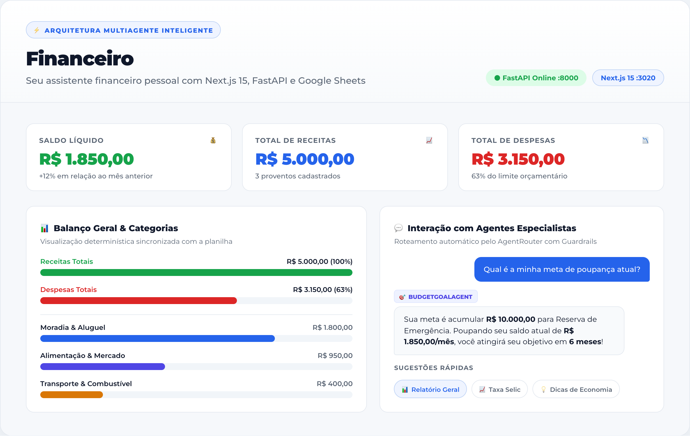
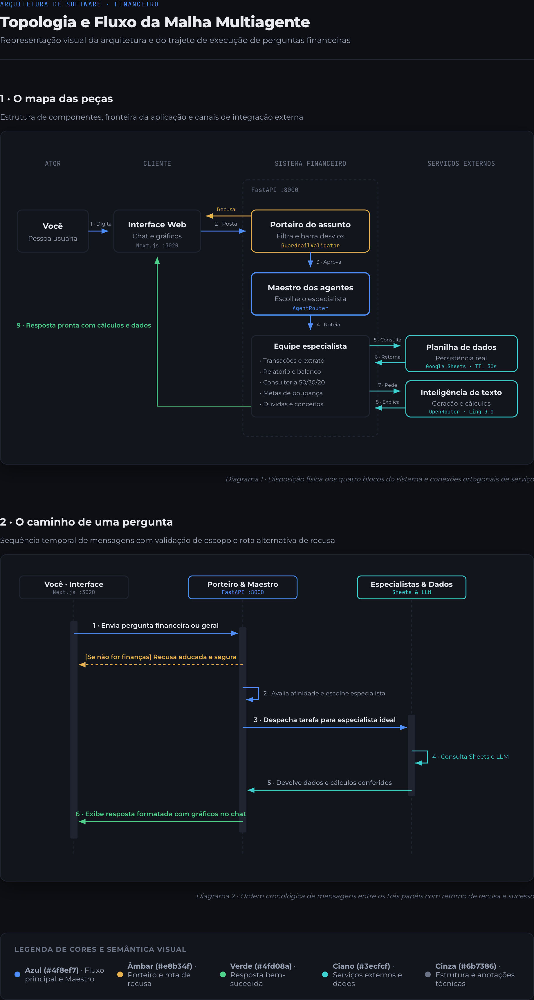

<div align="center">



# 💰 Financeiro — Seu Assistente Pessoal Inteligente

**Controle financeiro simples, inteligente e sem complicação.**  
Converse no chat como se estivesse falando com um amigo que entende de finanças, anote gastos na hora, consulte gráficos e acompanhe suas metas em tempo real.

[](https://fastapi.tiangolo.com)
[](https://nextjs.org)
[](https://python.org)
[](https://sheets.google.com)
[](LICENSE)

</div>

---

## ✨ O que é o Financeiro?

Cuidar do próprio dinheiro não deveria exigir planilhas complicadas, fórmulas confusas ou apps cheios de telas difíceis.

O **Financeiro** é um assistente aberto e inteligente construído para simplificar sua rotina financeira. Você conversa em português claro pelo chat e o sistema faz todo o trabalho pesado:

1. **Anota gastos e ganhos na hora:** Basta dizer *"almocei por R$ 38 no restaurante"* ou *"recebi freela de R$ 1.200"*.
2. **Mostra gráficos e balanços em tempo real:** Saiba exatamente para onde seu dinheiro foi neste mês.
3. **Calcula metas de poupança:** Diga quanto quer juntar e em quanto tempo, e receba um plano prático de quanto economizar por mês.
4. **Tira dúvidas e ensina:** Não sabe o que é Selic, CDI ou como funciona a regra 50/30/20? É só perguntar!

---

## 🎬 Veja Como Funciona na Prática

Você pode digitar livremente ou usar os **botões de sugestão rápida** para agilizar seu dia a dia:

<div align="center">
  
</div>

---

## 👥 Conheça a Sua Equipe de Especialistas

Nos bastidores, você não fala com um robô genérico, mas com uma **equipe especializada de agentes inteligentes**. Cada um cuida com carinho de uma parte do seu dinheiro:

| Especialista | O que ele faz por você | Exemplos de perguntas que ele adora responder |
|---|---|---|
| **💳 TransactionAgent** | Registra entradas e saídas com precisão cirúrgica e categorização automática. | *"Gastei 45 reais no mercado"*, *"Recebi salário de 4500"* |
| **📊 ReportAgent** | Analisa seu extrato e gera resumos com gráficos visuais de receitas e despesas. | *"/relatorio"*, *"Qual é o meu saldo atual?"*, *"Quanto gastei em lazer?"* |
| **💡 AdvisoryAgent** | Atua como consultor de finanças, aplicando a regra 50/30/20 e indicando onde cortar custos. | *"Como posso economizar este mês?"*, *"Estou gastando muito em mercado?"* |
| **🎯 BudgetGoalAgent** | Ajuda você a planejar e conquistar objetivos financeiros de curto e longo prazo. | *"Quero juntar 5000 em 10 meses"*, *"Como montar minha reserva de emergência?"* |
| **📚 GeneralAgent** | Explica termos do mercado de forma didática e faz cálculos matemáticos sem errar. | *"O que é taxa Selic?"*, *"Quanto rende o CDI hoje?"*, *"Dividir conta de 150 por 3"* |

> 🛡️ **Segurança em primeiro lugar:** Todo o fluxo conta com um **Guardrail**, um guardião que garante foco total em finanças e impede perguntas fora de contexto ou perigosas.

---

## 🏛️ Como o Sistema Funciona por Dentro (Arquitetura)

O sistema foi desenhado de forma moderna, modular e de fácil manutenção:

<div align="center">
  
</div>

> 📐 **Visualizador Interativo Dark/SVG:** Abra [`docs/arquitetura.html`](docs/arquitetura.html) no navegador para inspecionar os diagramas vetoriais SVG de alta precisão (*1 · O mapa das peças* e *2 · O caminho de uma pergunta*).

```text
┌────────────────────────────────────────────────────────────────────────┐
│                          USUÁRIO / NAVEGADOR                           │
└───────────────────────────────────┬────────────────────────────────────┘
                                    │ HTTP / JSON (:3020)
                                    ▼
┌────────────────────────────────────────────────────────────────────────┐
│                     FRONTEND (Next.js 15 — :3020)                      │
│   • Interface Mobile-First          • Renderização Markdown & Badges   │
│   • Chips de Sugestões Rápidas      • Gráficos Determinísticos SVG     │
└───────────────────────────────────┬────────────────────────────────────┘
                                    │ REST POST /api/chat (:8000)
                                    ▼
┌────────────────────────────────────────────────────────────────────────┐
│                      BACKEND (FastAPI — :8000)                         │
│                                                                        │
│   ┌────────────────────────────────────────────────────────────────┐   │
│   │                    GUARDRAIL VALIDATOR                         │   │
│   │   • Validação de escopo estritamente financeiro                │   │
│   │   • Bloqueio de injeções de prompt e assuntos fora de contexto │   │
│   └───────────────────────────────┬────────────────────────────────┘   │
│                                   │ Mensagem Aprovada                  │
│                                   ▼                                    │
│   ┌────────────────────────────────────────────────────────────────┐   │
│   │                       AGENT ROUTER                             │   │
│   │   • Analisa a intenção e calcula afinidade de cada especialista│   │
│   │   • Despacha para o especialista com maior score (BaseAgent)   │   │
│   └───────────────────────────────┬────────────────────────────────┘   │
│                                   │                                    │
│               ┌───────────────────┼───────────────────┐                │
│               ▼                   ▼                   ▼                │
│      ┌─────────────────┐ ┌─────────────────┐ ┌─────────────────┐       │
│      │TransactionAgent │ │   ReportAgent   │ │  AdvisoryAgent  │       │
│      │ • Entradas/Saídas │ • Balanço geral │ │ • Regra 50/30/20│       │
│      │ • Categorização │ │ • Gráficos SVG  │ │ • Consultoria   │       │
│      └────────┬────────┘ └────────┬────────┘ └────────┬────────┘       │
│               │                   │                   │                │
│               └─────────┬─────────┴─────────┬─────────┘                │
│                         ▼                   ▼                          │
│                ┌─────────────────┐ ┌─────────────────┐                 │
│                │ BudgetGoalAgent │ │  GeneralAgent   │                 │
│                │ • Metas poupança│ │ • Conceitos     │                 │
│                │ • Prazos & plano│ │ • MathTool      │                 │
│                └────────┬────────┘ └────────┬────────┘                 │
└─────────────────────────┼───────────────────┼──────────────────────────┘
                          │                   │
             ┌────────────┴─────────┐         │
             ▼                      ▼         ▼
    ┌──────────────────┐   ┌───────────────────────────┐
    │  Google Sheets   │   │      OpenRouter LLM       │
    │  • Persistência  │   │  • Modelo Ling Flash Fin  │
    │  • Cache TTL 30s │   │  • Failover em cascata    │
    │  • Extrato real  │   │  • Base local offline     │
    └──────────────────┘   └───────────────────────────┘
```

### O ciclo de uma mensagem em 4 passos simples:
1. **Interface (Next.js 15):** Você acessa pelo navegador (celular ou computador na porta `3020`) com visual limpo, botões rápidos e gráficos interativos.
2. **API & Validação (FastAPI + Guardrail):** A requisição chega à API na porta `8000`. O `GuardrailValidator` verifica se o assunto é financeiro e seguro.
3. **Maestro da Malha (AgentRouter):** O roteador analisa a intenção e encaminha a mensagem para o especialista certo (Transações, Relatórios, Consultoria, Metas ou Dúvidas Gerais).
4. **Ferramentas Determinísticas e Planilha:** Cálculos matemáticos são realizados pela `MathTool` (sem alucinações de IA) e todos os dados são sincronizados no **Google Sheets**.

---

## 🚀 Como Rodar o Projeto no seu Computador

### 📋 Pré-requisitos
- **Python 3.11+** com o gerenciador [`uv`](https://docs.astral.sh/uv/) instalado.
- **Node.js 18+** e `npm`.

---

### 1. Clonar o repositório e configurar variáveis
```bash
git clone https://github.com/nathanramorim/financeiro.git
cd financeiro

# Crie o arquivo de configuração a partir do modelo seguro:
cp .env.example .env
```

Abra o arquivo `.env` e configure sua chave de API do [OpenRouter](https://openrouter.ai/) (opcional se for utilizar a base local offline de conceitos):
```env
OPENROUTER_API_KEY=sua_chave_aqui
OPENROUTER_MODEL=inclusionai/ling-3.0-flash-fin:free
OPENROUTER_BASE_URL=https://openrouter.ai/api/v1
GOOGLE_SHEETS_CREDENTIALS_FILE=credentials.json
GOOGLE_SHEET_NAME=Financeiro
```

---

### 2. Iniciar tudo com um único comando

O projeto conta com um script automatizado que inicia o backend e o frontend juntos:

```bash
./scripts/dev.sh
```

Pronto! Agora é só abrir no navegador:
- 🌐 **Interface Web:** [http://localhost:3020](http://localhost:3020)
- ⚙️ **Documentação da API (Swagger):** [http://localhost:8000/docs](http://localhost:8000/docs)

---

### 3. Ou, se preferir, execute em dois terminais separados:

**Terminal 1 — Backend (FastAPI):**
```bash
uv run uvicorn src.api.main:app --port 8000 --reload
```

**Terminal 2 — Frontend (Next.js):**
```bash
cd frontend
npm install
npm run dev
```

---

## 🧪 Como Executar os Testes

Garantimos estabilidade com testes automatizados para toda a suíte de agentes, ferramentas e endpoints:

```bash
# Testes do Backend (60 testes unitários e de integração):
uv run pytest

# Verificação do Frontend (Next.js build & type-check):
npm run build --prefix frontend
```

---

## 📚 Documentação Aprofundada

Para quem quer mergulhar a fundo ou estender o sistema:
- 🧭 [Guia dos Agentes para Leigos](docs/guia_agentes_para_leigos.md) — Explicação completa de personas, vocabulário e como cada agente responde.
- 🛠️ [Como Criar Novos Agentes](docs/criando_novos_agentes.md) — Tutorial com código para plugar novos especialistas sem alterar as rotas existentes.
- 🔄 [Fluxo da Arquitetura Multiagente](docs/fluxo_arquitetura_multiagente.md) — Diagramas técnicos detalhados de sequência e dependências.
- 📘 [Guia de Criação de READMEs Atraentes](docs/guia_criacao_readme_amigavel.md) — Passo a passo para criar READMEs amigáveis, com diagramas no estilo Claude Code e demonstrações em GIF.

---

## 🤝 Contribuição & Licença

Contribuições são super bem-vindas! Sinta-se à vontade para abrir uma *issue* com ideias ou enviar um *Pull Request*.

Este projeto é disponibilizado sob a licença [MIT](LICENSE).
