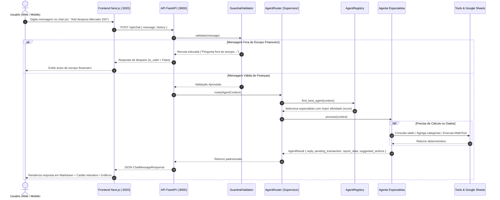
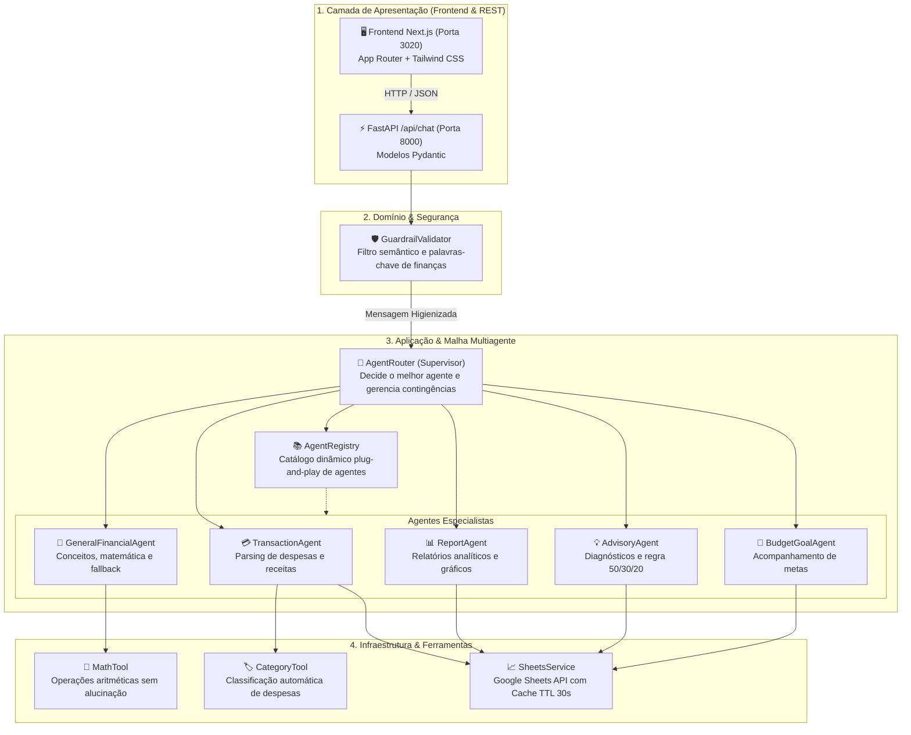

# 🔄 Fluxo Completo da Arquitetura Multiagente

Este documento detalha o ciclo de vida completo de uma mensagem enviada pelo usuário até a renderização visual da resposta na interface, demonstrando a interação entre Next.js, FastAPI, Guardrails, Supervisor e Agentes Especialistas.

---

## 1. Diagrama de Sequência de Ponta a Ponta

---

## 2. Diagrama de Blocos da Arquitetura (Clean Architecture)

---

## 3. As 6 Fases do Ciclo de Vida da Requisição

### Fase 1: Entrada no Frontend (`Next.js` na porta 3020)
- O usuário envia uma mensagem textual na interface responsiva (mobile ou desktop).
- O hook `useChat` empacota a mensagem e o histórico da conversa e dispara uma requisição `fetch` assíncrona para o endpoint `POST /api/chat`.

### Fase 2: Recepção na API (`FastAPI` na porta 8000)
- O controller FastAPI recebe a requisição e valida a estrutura JSON usando o modelo Pydantic `ChatMessageRequest`.
- O CORS configurado permite a comunicação segura entre as origens locais.

### Fase 3: Filtragem de Segurança (`GuardrailValidator`)
- A mensagem é submetida ao validador de escopo financeiro estrito.
- Mensagens fora do contexto financeiro (receitas culinárias, futebol, piadas) são filtradas imediatamente, sem gastar processamento de IA ou serviços externos.

### Fase 4: Descoberta e Roteamento (`AgentRouter` & `AgentRegistry`)
- A mensagem é empacotada em um `AgentContext`.
- O `AgentRouter` aciona o `AgentRegistry.find_best_agent(context)`.
- Cada especialista avalia a mensagem através do método `can_handle(context)` e devolve sua pontuação de afinidade (0.0 a 1.0).
- O agente com maior pontuação é selecionado para executar a tarefa.

### Fase 5: Execução Especializada com Zero Alucinação
- O especialista acionado executa seu método `process(context)`.
- Se a operação envolver matemática, o `MathTool` é utilizado.
- Se envolver persistência ou leitura, o `SheetsService` acessa a planilha (utilizando cache em memória com TTL de 30s para proteger a cota da Google Sheets API).
- Em caso de instabilidade não prevista no especialista, o `AgentRouter` aciona o fallback resiliente com o `GeneralFinancialAgent`, garantindo que a API nunca retorne erro 500 para o usuário.

### Fase 6: Resposta Estruturada e Renderização Visual
- O agente retorna um `AgentResult` contendo:
  - Texto explicativo formatado em Markdown rico (cabeçalhos, negrito, listas, destaques).
  - Dados opcionais de transação pendente (`pending_transaction`), ativando botões interativos `[✅ Confirmar]` e `[❌ Cancelar]`.
  - Dados opcionais de relatório (`report_data`), acionando os gráficos SVG responsivos.
  - Chips de ações sugeridas (`suggested_actions`).
- O frontend Next.js recebe o payload e atualiza a interface instantaneamente.
