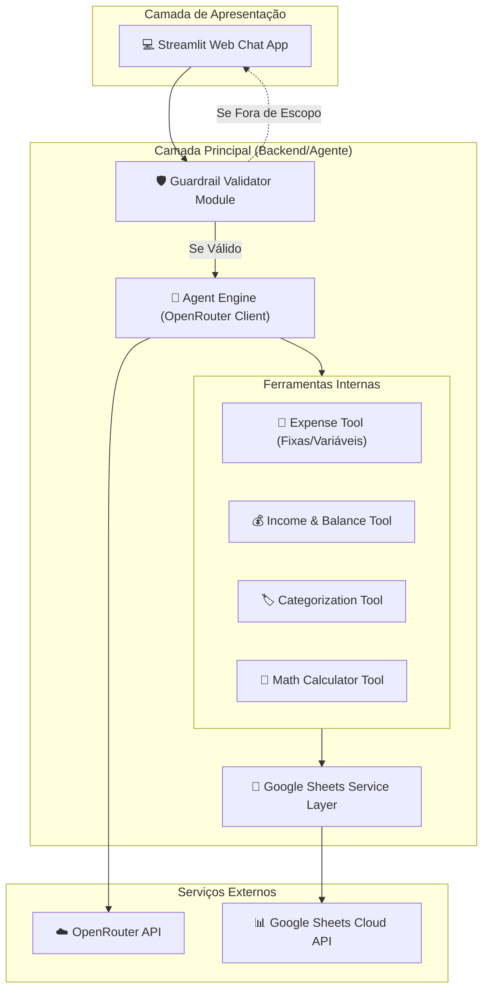

# Critérios Técnicos 01 — Agente Financeiro Inteligente

## 1. Restrições e Princípios Técnicos
- **Gerenciador de Dependências:** Uso exclusivo do `uv` (`uv venv`, `uv run`, `uv add`).
- **Segurança & Guardrails:** Nenhuma mensagem é processada pelo modelo LLM sem passar primeiro pela camada de validação de escopo financeiro.
- **Precisão Numérica:** Toda operação matemática solicitada pelo usuário (dividir por N, multiplicar por N, parcelamento) deve ser resolvida deterministicamente pelo módulo `MathTool` em Python.
- **Persistência Externa:** A leitura e escrita de dados devem ser sincronizadas com o Google Sheets via API oficial `gspread` / Google Auth OAuth2.

## 2. Diagrama de Arquitetura da Solução (C4 Model)

## 3. Critérios de Aceitação Executáveis

### CA-01: Validação de Guardrail
- **Dado** que o usuário envia um prompt fora do contexto financeiro (ex: *"Como fazer bolo de chocolate?"*).
- **Quando** a mensagem é processada pelo Guardrail.
- **Então** o sistema deve rejeitar a solicitação com mensagem amigável sem chamar a API da LLM OpenRouter.

### CA-02: Consulta e Cadastro de Despesas Fixas
- **Dado** que o usuário solicita o cadastro de uma despesa fixa de aluguel no valor de R$ 2000.
- **Quando** o agente processa a solicitação.
- **Então** uma nova linha deve ser inserida na aba de despesas do Google Sheets com a categoria correspondente e a marcação `fixa`.

### CA-03: Operações Matemáticas sob Demanda
- **Dado** que o usuário solicita *"Divida por 2 a despesa de Internet de R$ 200"*.
- **Quando** a `MathTool` é acionada pelo agente.
- **Então** o cálculo `200 / 2 = 100` é executado deterministicamente e o valor atualizado de R$ 100 é refletido na consulta/planilha.

### CA-04: Consolidação de Saldo e Receitas
- **Dado** que a planilha possui R$ 5000 em receitas e R$ 3000 em despesas.
- **Quando** o usuário pergunta pelo seu saldo.
- **Então** o agente deve retornar o saldo líquido de R$ 2000 com o detalhamento de entradas e saídas.
