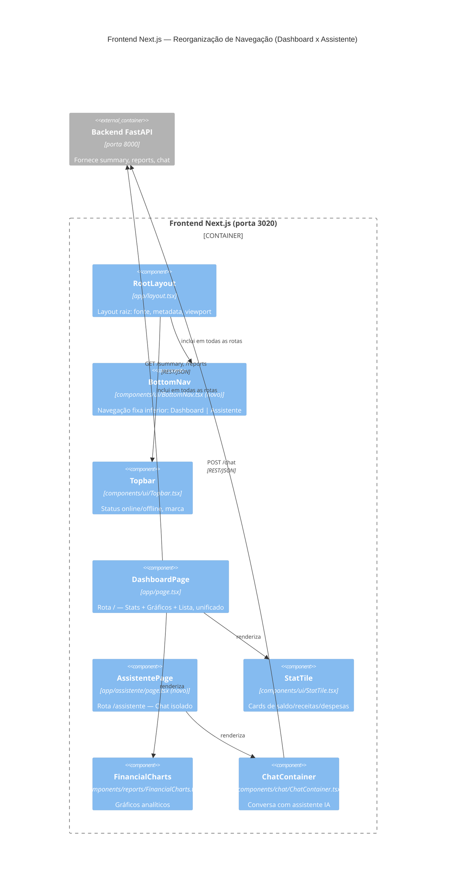

# Critérios 2320 — Dashboard Unificado & Assistente Isolado

## Restrições
- Stack fixa pela constituição: Next.js App Router, TailwindCSS, mobile-first (360px+) obrigatório (`sdd/memory/constitution.md`).
- Nenhuma mudança de contrato de API — `checkApiHealth`, `fetchFinancialSummary`, `fetchReports` (`frontend/src/infrastructure/api`) continuam iguais.
- Componentes reaproveitados sem reescrita de lógica interna: `StatTile`, `FinancialCharts`, `ChatContainer`, `Card`, `Badge`, `Button`, `Topbar`.
- Seguir Design System (`.agents/rules/design-system.md`) para a nova bottom nav (cores, espaçamento, estados ativo/inativo).

## Integridade
- Polling de dados (`loadData`, intervalo de 15s) deve continuar funcionando quando o usuário estiver na rota `/` (dashboard). Não precisa rodar em `/assistente`, já que lá não há StatTiles/gráficos visíveis — mas o status da API (`apiStatus`) deve ser preservado ou recalculado ao entrar na rota do assistente, para a Topbar não perder o indicador Online/Offline.
- Estado do chat (`ChatContainer`) não deve ser perdido ao navegar entre rotas, se tecnicamente viável com App Router (ex.: manter montado via layout compartilhado, ou aceitar remount com histórico persistido pelo próprio `ChatContainer`, se já fizer isso). Validar comportamento atual do `ChatContainer` antes de decidir a estratégia na feature.
- Bottom nav fixa não deve sobrepor conteúdo scrollável (padding-bottom suficiente no container principal de cada rota).

## C4 Model — Visão de Componentes (Container: Frontend Next.js)

## Critérios de aceitação (executáveis)
1. Acessar `/` mobile (360px) exibe, em um único scroll, nesta ordem: StatTiles → FinancialCharts → Lista de despesas fixas — sem nenhum controle de abas na tela.
2. Acessar `/assistente` exibe apenas o `ChatContainer` (mais Topbar e BottomNav), sem StatTiles/gráficos/lista.
3. Uma `BottomNav` fixa (bottom, `position: sticky/fixed`) com 2 itens (Dashboard, Assistente) está presente em ambas as rotas, com item ativo destacado visualmente.
4. Navegar entre `/` e `/assistente` via BottomNav não recarrega a página inteira (client-side routing do Next.js) e preserva o indicador `apiStatus` da Topbar.
5. Nenhuma regressão nos testes de frontend existentes; se não houver testes de UI cobrindo `page.tsx`, validar manualmente em viewport 360px, 768px e 1280px.
6. Backend não sofre nenhuma alteração — `git diff` da feature restrito a `frontend/src/**`.
