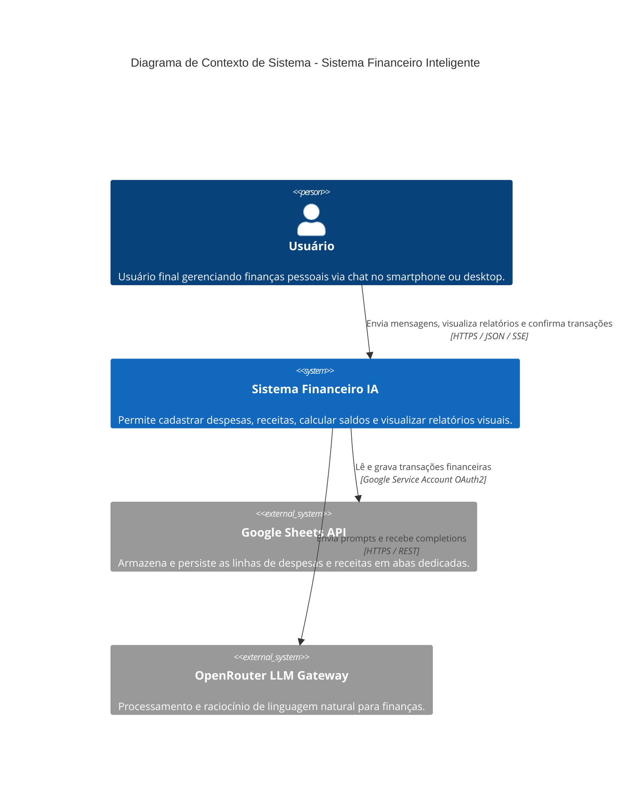
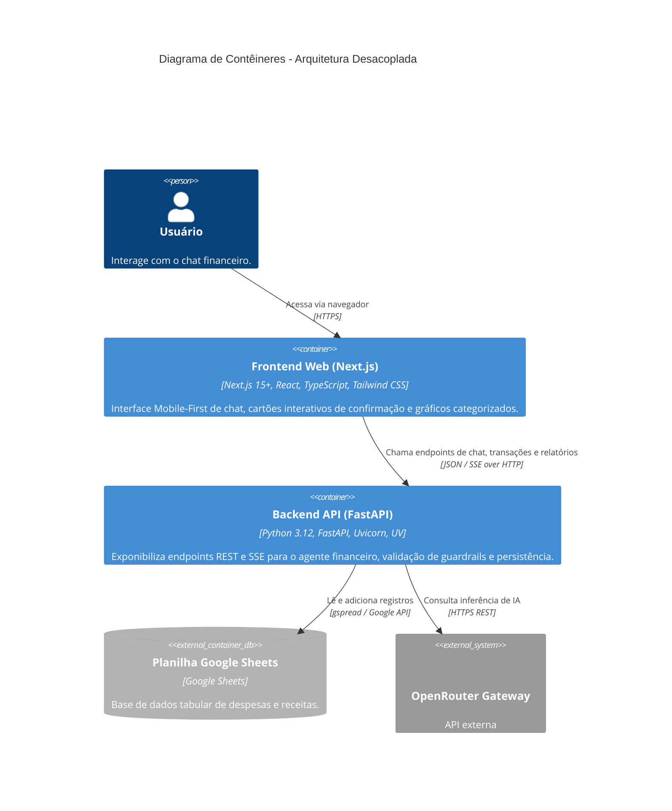

# Critérios Técnicos — Discovery a102: Migração API (FastAPI) e Frontend (Next.js)

## 1. Visão Técnica e Arquitetural (C4 Model)

### 1.1 Diagrama de Contexto de Sistema (C4 - Nível 1)

---

### 1.2 Diagrama de Contêineres (C4 - Nível 2)

---

## 2. Especificação da API Backend (FastAPI)

### 2.1 Endpoints Principais
| Método | Rota | Descrição | Formato Entrada / Saída |
|--------|------|-----------|-------------------------|
| `POST` | `/api/chat` | Envia mensagem do usuário, aplica guardrail e executa raciocínio | `{ message: str }` ➔ `{ reply: str, pending_transaction: Optional[dict], report_data: Optional[dict] }` |
| `POST` | `/api/chat/stream` | Streaming de resposta via Server-Sent Events (SSE) | Eventos em tempo real com tokens e estado final |
| `POST` | `/api/transactions/confirm` | Confirma e executa transação pendente | `{ action: str, descricao: str, valor: float, categoria?: str }` ➔ `{ success: bool, message: str, item: dict }` |
| `GET` | `/api/transactions` | Retorna lista de despesas e receitas | `?tipo=fixa` ➔ `{ expenses: list, incomes: list, balance: dict }` |
| `GET` | `/api/reports` | Retorna totais e agregação por categoria | `{ total_receitas, total_despesas, saldo_liquido, despesas_por_categoria }` |
| `GET` | `/health` | Checagem de integridade e status de dependências | `{ status: "ok", sheets: bool, openrouter: bool }` |

---

## 3. Requisitos e Restrições Técnicas

1. **Stack do Backend:**
   - Python ≥ 3.12 gerenciado exclusivamente por `uv` (`uv add fastapi uvicorn sse-starlette`).
   - Servidor ASGI executável via `uv run uvicorn src.api:app --reload --port 8000`.
   - Suporte a CORS configurado explicitamente para a porta do Next.js (ex: `http://localhost:3000`).
2. **Stack do Frontend:**
   - Next.js (App Router), TypeScript estrito, Tailwind CSS.
   - Aplicação rigorosa dos tokens do Design System (`.agents/rules/design-system.md`):
     - Cores: `--primary` (#2563eb), `--panel` (#f6f8fb), `--panel-border` (#e4e9f0), etc.
     - Fonte: Montserrat via `next/font/google`.
     - Mobile-First: Layout totalmente responsivo com suporte a toque e teclado.
3. **Persistência e Compatibilidade:**
   - Reutilização total da camada de persistência existente (`src/services/sheets.py`), garantindo que planilhas existentes continuem funcionando sem migração de dados.
   - `MathTool.parse_float` continua como o validador numérico central de ambos os fluxos.

---

## 4. Critérios de Aceitação Técnicos

- [ ] A API FastAPI inicializa com sucesso em `http://localhost:8000` via comando `uv run uvicorn`.
- [ ] Rota `GET /health` responde `200 OK` com status dos serviços integrados.
- [ ] Rota `POST /api/chat` processa guardrails, detecta intenções de mutação e pedidos de relatório.
- [ ] Rota `POST /api/transactions/confirm` adiciona despesas e receitas na planilha com persistência confirmada.
- [ ] Frontend Next.js comunica-se com a API FastAPI sem erros de CORS.
- [ ] Frontend implementa os botões interativos de confirmação e gráficos categorizados com design system oficial.
- [ ] Suíte de testes da API validada com cobertura de endpoints via `pytest` e `httpx`.
