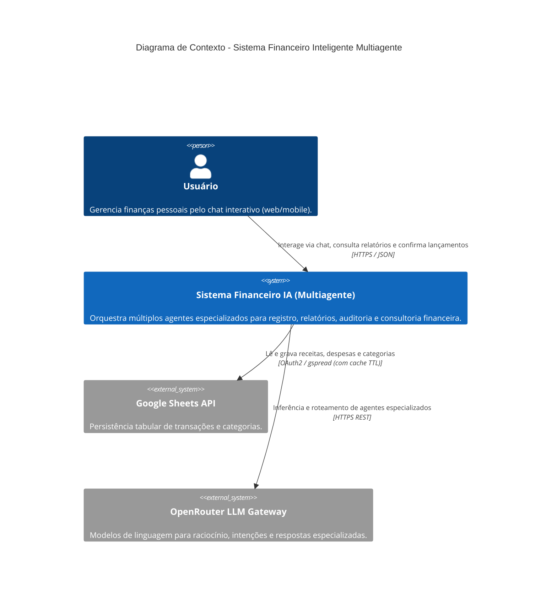
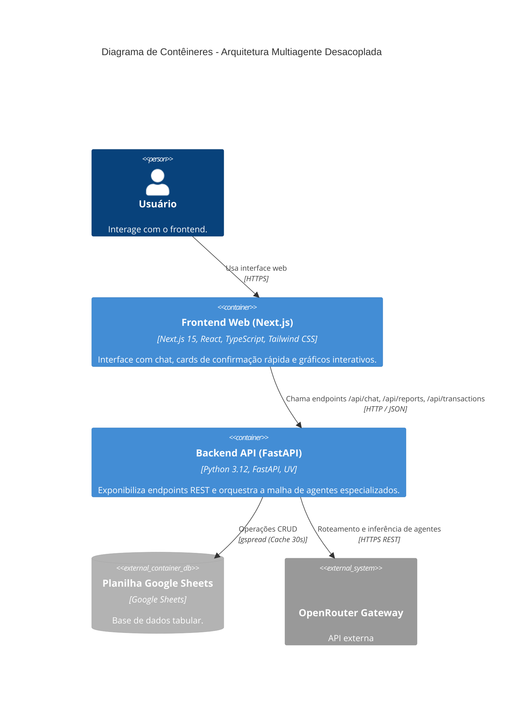
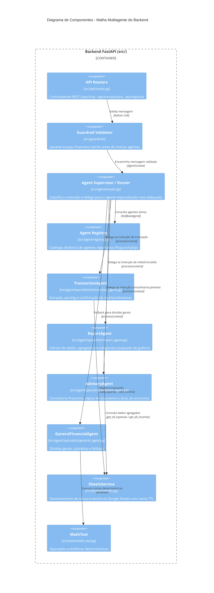

# Critérios Técnicos — Discovery e4b1: Arquitetura de API Multiagente Modular e Extensível

## 1. Visão Técnica e Arquitetural (C4 Model)

### 1.1 Diagrama de Contexto de Sistema (C4 - Nível 1)


---

### 1.2 Diagrama de Contêineres (C4 - Nível 2)


---

### 1.3 Diagrama de Componentes do Backend (C4 - Nível 3)


---

## 2. Contratos e Interfaces Técnicas

### 2.1 Modelo de Dados de Contexto e Retorno
```python
@dataclass
class AgentContext:
    message: str
    history: list[dict[str, str]]
    metadata: dict[str, Any] = field(default_factory=dict)

@dataclass
class AgentResult:
    reply: str
    agent_name: str
    confidence: float
    pending_transaction: Optional[dict] = None
    report_data: Optional[dict] = None
    action_taken: Optional[str] = None
    suggested_actions: list[str] = field(default_factory=list)
```

### 2.2 Contrato Base do Agente Especializado (`BaseAgent`)
```python
class BaseAgent(ABC):
    name: str
    description: str

    @abstractmethod
    def can_handle(self, context: AgentContext) -> float:
        """Retorna uma pontuação de confiança (0.0 a 1.0) sobre a capacidade do agente em resolver o pedido."""
        pass

    @abstractmethod
    def process(self, context: AgentContext) -> AgentResult:
        """Executa a tarefa especializada e retorna o resultado estruturado."""
        pass
```

### 2.3 Registro Dinâmico (`AgentRegistry`)
```python
class AgentRegistry:
    def register(self, agent: BaseAgent) -> None: ...
    def get(self, name: str) -> Optional[BaseAgent]: ...
    def get_all(self) -> list[BaseAgent]: ...
    def find_best_agent(self, context: AgentContext) -> tuple[BaseAgent, float]: ...
```

---

## 3. Critérios de Aceitação e Qualidade

1. **Extensibilidade e Plug-and-Play:**
   - Criar um novo agente deve exigir apenas estender `BaseAgent` e registrá-lo no `AgentRegistry`.
   - Nenhuma modificação nas rotas do FastAPI (`/api/chat`, etc.) deve ser necessária para habilitar um novo agente especializado.
2. **Conformidade com Clean Architecture:**
   - Domínio (`src/guardrail/` e contratos de agente): livre de dependências de framework web ou bibliotecas de UI.
   - Aplicação (`src/agent/`): orquestração pura, controle de histórico e supervisão.
   - Infraestrutura (`src/services/`, `src/tools/`): integrações externas isoladas.
3. **Determinismo Aritmético:**
   - Nenhuma operação matemática em relatórios ou cálculos deve ser inventada por LLM livre; deve ser computada via `MathTool` ou rotinas analíticas do `ReportAgent`.
4. **Resiliência e Fallback Gracioso:**
   - Se um agente especializado falhar ou tempo limite expirar, o `AgentRouter` deve ativar fallback seguro para o `GeneralFinancialAgent` sem derrubar a API.
5. **Compatibilidade com Frontend:**
   - O payload do endpoint `/api/chat` mantém estrita retrocompatibilidade com o frontend Next.js (`reply`, `pending_transaction`, `report_data`), adicionando campos enriquecidos (`agent_name`, `suggested_actions`).
6. **Cobertura de Testes:**
   - 100% dos testes existentes (34 testes unitários) devem continuar passando.
   - Novos testes unitários dedicados para cada agente especializado (`TransactionAgentTest`, `ReportAgentTest`, `AdvisoryAgentTest`, `AgentRegistryTest`, `RouterTest`).
