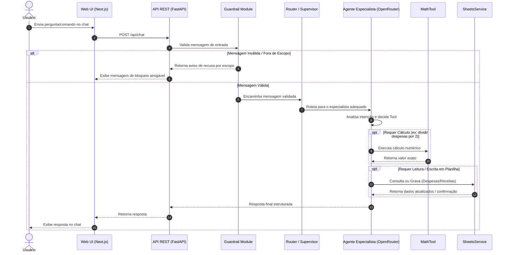

# Fluxos — financeiro

## 1. Fluxo Principal de Processamento de Mensagens

## 2. Fluxo de Consulta de Despesas Fixas e Saldo
1. Usuário solicita: *"Qual o total das minhas despesas fixas este mês e meu saldo?"*
2. Guardrail aprova a solicitação.
3. Agente ativa a Tool de Despesas e busca na planilha as linhas classificadas como `fixa`.
4. Agente ativa a Tool de Saldo para obter total de receitas vs despesas.
5. Agente formata os dados e retorna o resumo para a UI.

## 3. Fluxo de Cadastro com Operação Matemática e Categorização
1. Usuário solicita: *"Cadastre a despesa de Aluguel de R$ 1500 multiplicada por 2 e categorize"*.
2. Guardrail valida e aprova.
3. Agente executa `MathTool.evaluate("1500 * 2")` -> `R$ 3000`.
4. Agente chama `CategoryModule` -> categoriza como `Moradia / Despesa Fixa`.
5. Agente chama `SheetsService` -> insere nova linha na planilha Google Sheets.
6. Agente confirma o cadastro na interface de chat.
