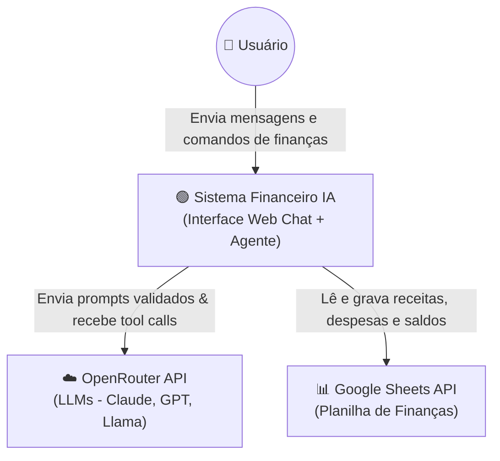
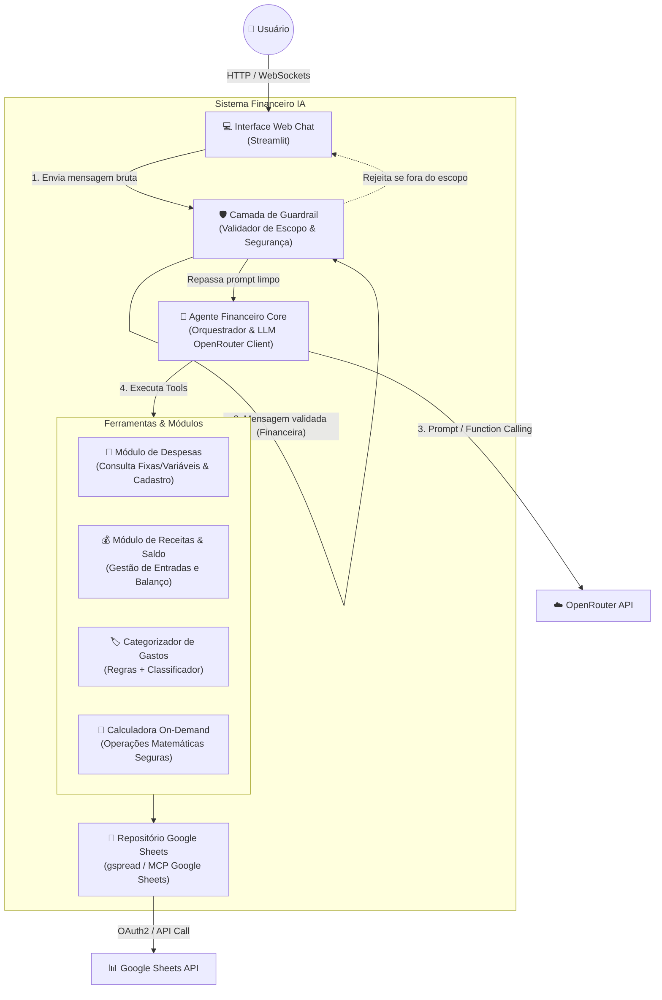

# Overview — financeiro

O **financeiro** é uma aplicação de assistente virtual para gestão financeira pessoal com interface Web Chat. O sistema processa solicitações em linguagem natural via modelos LLM (conectados via OpenRouter), aplica uma camada estrita de guardrails para garantir foco e segurança no domínio financeiro, executa operações matemáticas com precisão através de ferramentas dedicadas e persiste receitas e despesas no Google Sheets.

## Índice
- `stack.md` — tecnologias e estrutura de diretórios
- `modules.md` — componentes e responsabilidades
- `flows.md` — fluxos de execução principais
- `decisions.md` — decisões de arquitetura (ADRs)

---

## Arquitetura (C4 Model)

### Nível 1: Contexto

### Nível 2: Containers

